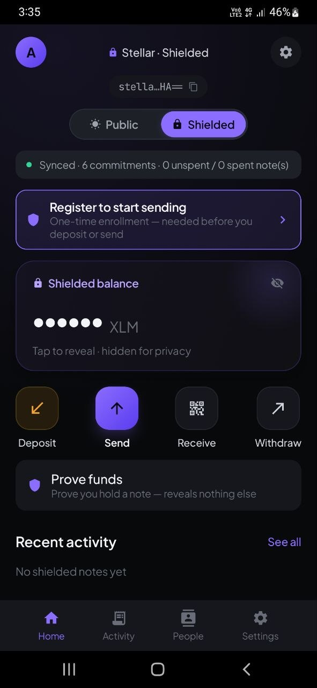
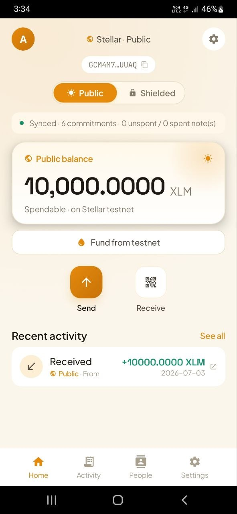
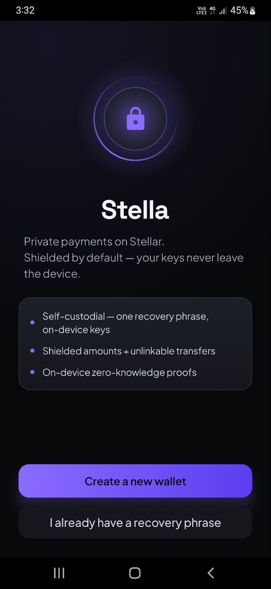
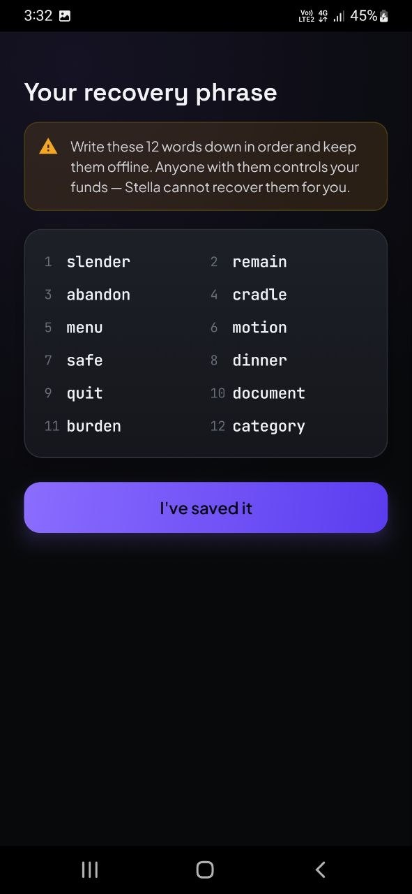
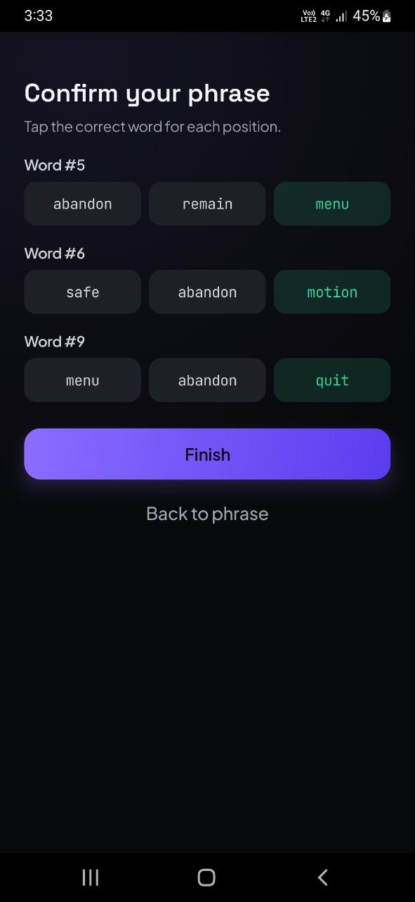
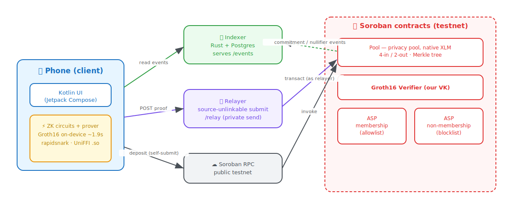

# Stella — private payments wallet on Stellar

A self-custodial **Android** wallet for **shielded payments** on the Stellar testnet. Built on
Nethermind's privacy-pool Soroban contracts + Circom circuits, **forked and vendored in-repo**, with
**zero-knowledge proofs generated on-device**. Deposit publicly into a pool, then send or withdraw
privately — amounts and links are hidden behind a Groth16 proof the phone produces itself (~1.9 s via
rapidsnark). A second, fully classic **☀ Public** mode sits right alongside for plain public XLM.

<p align="center">
  
  
</p>

> **Testnet only. Unaudited. Do not use with real assets.**

---

## Contents

- [Feature guide (visual walkthrough)](#feature-guide) — every screen + how to use it
- [Architecture](#architecture) — the four moving parts
- [Repo layout](#repo-layout)
- [Build & run](#build--run)
- [Deployed contracts & example transactions](#deployed-contracts--example-transactions)
- [Demo](#demo)

---

<a name="feature-guide"></a>
## Feature guide

### 1. Onboarding — create or import a wallet
One BIP39 12-word phrase (SEP-5 `m/44'/148'/0'`), Keystore-encrypted on device. From it Stella
derives unlimited accounts, each with its own Stellar address **and** its own shielded (note +
encryption) keys.

**How to use:** launch → **Create wallet** (write the 12 words down) or **Import** an existing phrase
→ confirm a few words → you land on Home.

<p align="center">
  
  
  
</p>

### 2. Two faces, one wallet — Public ☀ / Shielded 🔒
A tap-or-swipe slider flips between **Public** (plain Stellar XLM) and **Shielded** (the privacy
pool). Each face has its own palette, balance card, and activity feed; the transition is a
circular reveal anchored to the thumb.

**How to use:** tap or drag the slider at the top of Home. Everything below re-themes to the active
rail.

<p align="center">
  
  
</p>

### 3. Fund from testnet
New accounts start empty. One tap asks friendbot for testnet XLM.

**How to use:** **Fund from testnet** on Home → wait for the balance to appear.

<p align="center"></p>

### 4. Register (one-time ASP enrollment)
To **spend** from the pool (deposit, send, withdraw) an account is enrolled once into the on-chain
ASP membership set. **Receiving needs no enrollment.**

**How to use:** the app prompts on your first spend → **Register** → one on-chain tx, then continue.

<p align="center"></p>

### 5. Deposit — public XLM into the shielded pool
Moves public XLM into the pool as an encrypted note. Public and always self-submitted (the deposit
amount is visible by design; the note contents are not).

**How to use:** Shielded Home → **Deposit** → amount → **Confirm** → proof builds → done.

<p align="center">
  
  
</p>

### 6. Private send (P2P) — routed through the relayer
Spends your notes and pays a recipient's **shielded** address. The proof is built on-device and
POSTed to the relayer, which submits it as **its own account** — the wallet's Stellar account never
appears on-chain (source-unlinkable). `ext_data_hash` binds the recipient + amount inside the proof,
so the relayer cannot redirect or skim.

**How to use:** Shielded Home → **Send** → paste/scan a `stella:` address (or pick a contact) →
amount → **Confirm**.

<p align="center">
  
  
</p>

### 7. Withdraw — shielded pool back to a public address
Consolidates up to 4 notes and pays out to any public `G…` address, also via the relayer.

**How to use:** Shielded Home → **Withdraw** → destination `G…` address → amount → **Confirm**.

<p align="center"></p>

### 8. The proof moment — on-device Groth16
Every shielded spend builds a real Groth16 proof on the phone (rapidsnark, ~1.9 s on the 4-in/2-out
circuit; cached arkworks fallback ~4–5 s). No server ever sees your keys, amounts, or recipients.

**How to use:** nothing — the stepper shows proof progress, then the success screen reports
*"ZK proof built on your phone in X.Xs."*

<p align="center">
  
  
</p>

### 9. Success + share receipt
Scale-in confetti, the proof timing, and **Share receipt** (verb + amount + tx hash + explorer URL).

**How to use:** appears automatically after any send/withdraw/deposit; tap **Share** to hand off a
receipt.

### 10. Activity — mode-aware history
Public payments grouped by day with a tap-through to stellar.expert; shielded notes labelled
**Deposit / Received / Sent / Change (to self)**, filterable with chips. Pending spends show a
spinner row instantly and resolve when the note-set changes.

**How to use:** the **Activity** tab → filter chips at the top → tap any row for detail.

<p align="center">
  
  
</p>

### 11. Transaction detail
Hero amount + type/status/date/privacy badge. Public txns get a stellar.expert button; shielded
events show leaf index + commitment (no public tx hash exists for a shielded event).

<p align="center"></p>

### 12. People — address book + QR scan
Save a name against a public `G…` and/or shielded `stella:` address, then send straight to it. New
contacts can be added by scanning a QR. Your own other accounts appear as one-tap **quick-pick
chips** on the Send screen (MetaMask-style), no copy-paste round trip.

**How to use:** **People** tab → **Add** (type or **Scan QR**) → later, tap a contact to jump into
Send prefilled. Edit with the pencil.

<p align="center">
  
  
</p>

### 13. Receive
Shows a QR + copyable string for the active address (public `G…` or shielded `stella:`).

<p align="center"></p>

### 14. Viewing key — auditor disclosure (export)
Export a **`stellaview2:`** viewing key = your encryption key **+** nullifier-deriving key (`nk`).
The holder can, from public chain data alone, see every payment you **receive**, see **when notes are
spent**, distinguish **change from real payments**, and compute your **net balance** — but can
**never move funds**. A [Zcash-style full-viewing-key split](docs/full-viewing-key.md) makes this
possible. It is permanent and irrevocable; the export screen states this before revealing the key.

**How to use:** **Settings → Viewing key** → read the warning → **Copy** / **Share** / show QR.

<p align="center"></p>

### 15. Audit a wallet
Paste (or scan) someone's `stellaview2:` key to replay their history read-only: total received, spend
netting, change detection, net unspent — with dates.

**How to use:** **Settings → Audit a wallet** → paste key → watch *"Scanned N of M"* → read the
report.

<p align="center"></p>

### 16. Proof of funds (selective disclosure)
Prove ownership of a note of amount **X**, bound to a named authority + purpose, without revealing
which note or your balance. Four on-verify checks: proof ∧ context ∧ known-root ∧ amount.

**How to use:** Shielded Home → **Prove funds** → authority + purpose → **Copy / Share** the receipt.

<p align="center"></p>

### 17. Settings — accounts, recovery, backup
Switch/add accounts (each a distinct SEP-5 address with its own shielded keys), reveal the recovery
phrase, and take an **encrypted Google Drive backup** (AES-256-GCM, `appDataFolder`).

<p align="center">
  
  
</p>

### 18. Network status & haptics
A sync banner on every tab (green / amber / red dot + **Retry**); a warning on the private-send
Confirm screen when the relayer is unreachable. Haptic ticks on confirm, copy, mode-switch, and
success/error.

<p align="center"></p>

---

<a name="architecture"></a>
## Architecture

Four moving parts: **ZK circuits + prover** (on the phone), **smart contracts** (on Soroban), the
**indexer**, and the **relayer**.

<p align="center"></p>

> Source is `docs/architecture.excalidraw` — open it at [excalidraw.com](https://excalidraw.com) to
> edit and export a hand-drawn PNG.

- **Phone** builds the Groth16 proof on-device (Rust prover via UniFFI, rapidsnark) and drives the UI
  in Kotlin/Compose.
- **Indexer** (Rust + Postgres) polls Soroban RPC for pool/ASP events and serves them at `/events`;
  the wallet rebuilds the complete commitment + ASP Merkle trees from that feed.
- **Relayer** submits private spends (withdraw/transfer) as its **own** account for source
  unlinkability; deposits self-submit through Soroban RPC.
- **Soroban contracts**: the **Pool**, the **Groth16 verifier**, and the two **ASP** contracts
  (membership allowlist + non-membership blocklist).

Both the indexer and the relayer are hosted on one EC2 box behind nginx (single origin — `/events` →
indexer, `/relay` → relayer); see `deploy/aws/`.

---

<a name="repo-layout"></a>
## Repo layout

```
prover-ffi/        Rust ZK library exposed to Kotlin via UniFFI
  src/lib.rs         exported FFI: derive_keys, prove_policy_tx_4_2_json, warm_up_provers,
                     verify_proof_bundle, assemble_{deposit,withdraw,transfer}, scan_note,
                     scan_commitment, compute_note_nullifier, rebuild_input_path,
                     build_unsigned_transact, finalize_and_sign, mnemonic_to_account,
                     issue/verify_disclosure_receipt, current_pool_root
  src/submit.rs      PURE tx build + sign (17-signal public inputs, 4 nullifiers); no network
  src/wallet.rs      BIP39 + SLIP-0010 ed25519 (SEP-5) derivation + backup-key HKDF
  src/rapidsnark_backend.rs   rapidsnark prover + snarkjs→Soroban proof re-encode
  circuits/          embedded proving key + r1cs + policytx42.wasm (NO underscores!)
  bindings/kotlin/   generated prover_ffi.kt

vendor/            our fork of the circuits, contracts, and core crates (ships with the app)
  circuits/          Circom: policy_tx_4_2 = PolicyTransaction(4,2,1,1,10,10) + nk split
  contracts/         Soroban pool / verifier / ASP (own cargo workspace)
  app/crates/        core prover / types / disclosure / zkhash (path deps)
  ceremony/          trusted-setup artifacts (final zkey + exported keys; toxic waste git-ignored)

fixture-gen/       dev tools that build valid circuit inputs against LIVE on-chain roots
indexer/           standalone Postgres-backed event indexer (axum + sqlx)
relayer/           source-unlinkable submit service (axum) for withdraw/transfer
deploy/aws/         Terraform + systemd + nginx to host indexer+relayer on EC2
android/           Compose app (com.privatepayments)
  app/src/main/java/com/privatepayments/
    MainActivity          flow router, sync + reconcile loop, prover warm-up
    net/{IndexerClient,RelayerClient,SorobanRpc,Endpoints,DriveBackup}
    state/{ChainStore,NoteStore,CoinSelector,ContactStore,WalletBackup}
    ui/*                  Home / Amount / Confirm / Proof / Success / Activity / TxDetail /
                          People / Receive / Settings / Recovery / Backup / ViewingKey / Audit /
                          Disclosure / Register / Onboarding + QR scanner + Format/Haptics/Common
  app/src/main/assets/    policy_tx_4_2_final.zkey (rapidsnark) + on-chain fixtures
  app/src/main/jniLibs/arm64-v8a/   libprover_ffi.so + libc++_shared.so

docs/              architecture diagram (.svg + .excalidraw) + full-viewing-key.md
walkthrough.md     deep dive: crypto, contracts, full request traces
plan.md            phase-by-phase status
```

---

<a name="build--run"></a>
## Build & run

### Prerequisites
- **Rust** (rustup) + `cargo install cargo-ndk` + `rustup target add aarch64-linux-android`
- **Android SDK + NDK** (r27+); set `ANDROID_HOME` and `ANDROID_NDK_HOME`
- **adb** + a physical **arm64 Android** device (or arm64 emulator) with USB debugging
- **JDK 17** — Gradle auto-provisions one via foojay if absent
- **Docker** — only if you self-host the indexer's Postgres

The app ships pointed at the **hosted** backend (`Endpoints.kt` → `http://52.66.141.112`,
`USE_RELAYER = true`), so a from-source build needs **no local services**. Steps 1 & 3 below are only
for running your own indexer/relayer.

### 1. Build the app from source
The Rust prover compiles to `libprover_ffi.so`; the Kotlin UniFFI bindings are committed.

```sh
# (a) build the prover → Android arm64 native lib, into jniLibs
export ANDROID_NDK_HOME="$ANDROID_HOME/ndk/<your-ndk-version>"   # e.g. 27.0.12077973
cargo ndk -t arm64-v8a -o android/app/src/main/jniLibs build -p prover-ffi --release --features rapidsnark

# (b) build the APK
cd android
./gradlew assembleDebug           # or assembleRelease

# (c) install on a connected device
adb install -r app/build/outputs/apk/debug/app-debug.apk
```

> Regenerate UniFFI bindings only if you change the Rust FFI surface:
> ```sh
> cargo run -p prover-ffi --bin uniffi-bindgen -- generate \
>   --library android/app/src/main/jniLibs/arm64-v8a/libprover_ffi.so \
>   --language kotlin --out-dir prover-ffi/bindings/kotlin
> cp prover-ffi/bindings/kotlin/uniffi/prover_ffi/prover_ffi.kt \
>   android/app/src/main/java/uniffi/prover_ffi/prover_ffi.kt
> ```

### 2. (Optional) run your own indexer + relayer
To point the app at localhost instead of AWS, uncomment the local origins in
`net/Endpoints.kt`, rebuild, then:

```sh
# Postgres (indexer's default DATABASE_URL: localhost:5434, user/pw/db = indexer)
docker run -d --name pp-indexer-pg -p 5434:5432 \
  -e POSTGRES_USER=indexer -e POSTGRES_PASSWORD=indexer -e POSTGRES_DB=indexer postgres:16
# next time: docker start pp-indexer-pg

# Indexer (:8080) — starts at the deployment ledger; RPC still retains the pool's full history
cargo build --release -p indexer
INDEXER_CONTRACTS="CAYDRYKMO23GEBDSUP5QUM3G4CMOS7YX3TICYAES2N2IAEI3GA22EBMS,\
CDGHHS4R45TKIUHYUZPNTYYND5R4KEO7J6VOOH4AYXJHRGEBYFXX27UK,\
CDQDK5VBZCLFWM7Z4TSSK3V6DRGNHP7ACLXXKQDZFPFEHTHGDW5CTEG5" \
INDEXER_START_LEDGER=3408703 \
./target/release/indexer
curl http://127.0.0.1:8080/health

# Relayer (:8090) — self-funds a fresh account via friendbot on first run
cargo build --release -p relayer && ./target/release/relayer
```

For a USB device: `adb reverse tcp:8080 tcp:8080 && adb reverse tcp:8090 tcp:8090`.
To host on AWS instead, see `deploy/aws/README.md` (`package.sh` → scp → `setup-server.sh`).

### 3. Desktop prover / flow tests
```sh
cargo test -p prover-ffi --lib <name> -- --ignored --nocapture   # proving is slow
```

---

<a name="deployed-contracts--example-transactions"></a>
## Deployed contracts & example transactions

Testnet, deployer/admin **`gate3`** = `GDFQA474KPZWWE4YAX6EAJVZHYO3SJR5DCQXV3U6GFDVMNNFZZ7UD2SD`.
Circuit: `policy_tx_4_2` = `PolicyTransaction(4,2,1,1,10,10)` + Zcash-style nullifier-key split
(17 public signals).

| Contract | ID | WASM hash |
|---|---|---|
| **Pool** (native XLM, 4-in/2-out) | `CAYDRYKMO23GEBDSUP5QUM3G4CMOS7YX3TICYAES2N2IAEI3GA22EBMS` | `f6ad4938…` |
| **Groth16 verifier** (our VK) | `CBQOCFRHT3CNONDDOZSNUJRLKGXN6KGYQG66XTIZUMGQKF4QI3SR2PUZ` | `0efd118b…` |
| **ASP membership** (permissionless allowlist) | `CDGHHS4R45TKIUHYUZPNTYYND5R4KEO7J6VOOH4AYXJHRGEBYFXX27UK` | `b5977d1d…` |
| **ASP non-membership** (blocklist) | `CDQDK5VBZCLFWM7Z4TSSK3V6DRGNHP7ACLXXKQDZFPFEHTHGDW5CTEG5` | `aaab97b2…` |

All four are built reproducibly from `vendor/contracts` (stellar-cli 25.1.0 `--optimize`, rustc 1.96.0) and source-verifiable on Stellar Expert via `.github/workflows/verify-contracts.yml`.

Explorer: `https://stellar.expert/explorer/testnet/contract/CAYDRYKMO23GEBDSUP5QUM3G4CMOS7YX3TICYAES2N2IAEI3GA22EBMS`

### Example transactions

> These landed on the **prior** pool deployment (`CAK4X4RK…`, since redeployed for
> reproducible verification) and remain on-chain as reference. They demonstrate the
> three flows; fresh examples on the current pool will be added after the next demo run.

| Flow | Tx hash | Submitted by |
|---|---|---|
| **Deposit** (public → pool) | [`10a9a947…f659e`](https://stellar.expert/explorer/testnet/tx/10a9a9475a0c9e72b7be655f873220563905f0441b0c2a2ed53e7f42c47f659e) | the account itself (self-submit) |
| **Withdraw** (pool → `G…`) | [`27b3d2bd…485b5`](https://stellar.expert/explorer/testnet/tx/27b3d2bdda411389802bfa91392db42b8bdb183e271c12bc460c7176875485b5) | the account itself |
| **Private send** (P2P) | [`1a7ce9a5…dec39`](https://stellar.expert/explorer/testnet/tx/1a7ce9a5dff41242f11ccfba72993e4a3aeea98b09c017111c51bff5f39dec39) | **relayer** `GD44DMEZ…55LUZ` — the wallet's account never appears |

The private-send tx demonstrates source unlinkability: its on-chain `source_account` **and**
`fee_account` are the relayer, not the sender's wallet.

---

<a name="demo"></a>
## Demo

_(demo video / walkthrough link — TODO)_

For a deep dive into the cryptography, contracts, and full request traces, see
**[walkthrough.md](walkthrough.md)**; for the viewing-key design, **[docs/full-viewing-key.md](docs/full-viewing-key.md)**.
